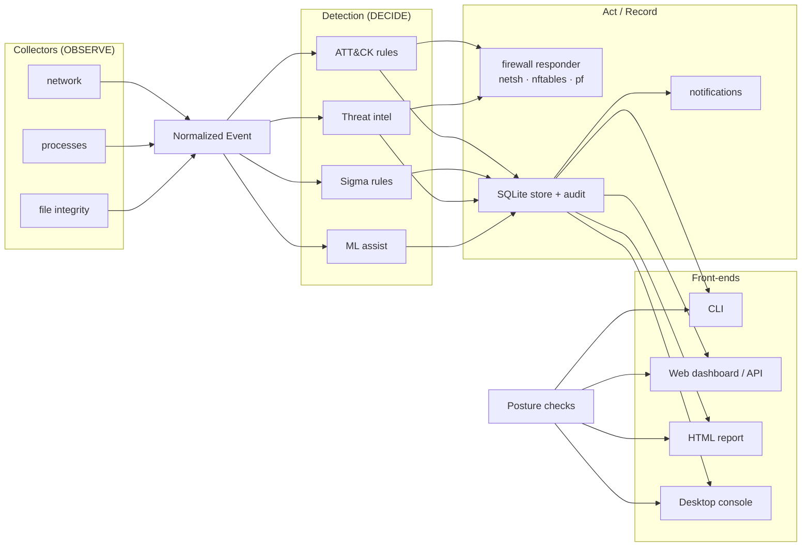

# 🛡️ Aegis — Host Security for Everyone

> **Find out how exposed your computer is, fix it in plain language, and catch
> attacks as they happen.** Aegis is a free, open-source, cross-platform host
> security tool: a security posture audit, threat-intelligence matching, MITRE
> ATT&CK-mapped intrusion detection, one-command containment, and a local web
> dashboard, for Windows, Linux and macOS.


---

## Install on Windows (no Python needed)

1. Download **`Aegis-Setup-<version>.exe`**: the `aegis-windows-installer`
   artifact of a release-tag CI run, or of a manual run (Actions > CI >
   Run workflow).
2. Double-click it and follow the steps. No administrator rights are needed.
3. Open **Aegis** from the Start menu. A short welcome guide shows where to begin.

To build the installer yourself: `packaging\build_windows.ps1` (needs Python,
plus [Inno Setup 6](https://jrsoftware.org/isinfo.php) for the installer step).

## Start in 60 seconds (command line, any OS)

```bash
pip install -e .              # headless install (add [ui] for the desktop console)

aegis check                   # 1. How secure is this machine? Score + fixes
aegis intel update            # 2. Download free blocklists of known-malicious IPs
aegis serve --monitor         # 3. Live detection + dashboard in your browser
```

`aegis check` on a typical laptop:

```text
Aegis security check (windows)

  [FAIL] No risky services exposed to the network
         1 service(s) that allow unauthenticated or cleartext access are reachable from the network.
           - Redis on port 6379 (redis-server.exe) listening on all interfaces
         Fix: Stop services you do not use. For the rest, bind them to 127.0.0.1, ...
  [WARN] Remote Desktop is off or protected
         Remote Desktop is enabled.
         Fix: Turn it off if unused (Settings > System > Remote Desktop). ...
  [PASS] Host firewall is enabled
         Windows Firewall is on for all 3 profiles.
  ...

Score 81/100 (grade B): 1 failed, 1 warnings, 6 passed, 0 skipped
```

## Who it is for

| You are... | Aegis gives you |
|------------|-----------------|
| **A home user or student** | A score for your machine and step-by-step fixes, no security background needed |
| **A developer / sysadmin** | Catches the classic mistakes (database on `0.0.0.0`, SSH password logins, firewall off) on laptops and servers; `--json` and `--fail-on` for scripts and CI |
| **A blue-teamer / SOC learner** | Explainable ATT&CK-mapped detections, Sigma rules, threat intel, containment and an append-only audit trail you can read and extend |

## Features

| Area | What it does |
|------|--------------|
| ✅ **Security posture audit** | `aegis check`: 12 read-only checks (firewall, exposed services, OS updates, suspicious startup programs, antivirus, UAC, RDP/NLA, SMBv1, auto-logon, disk encryption, SSH hardening, file permissions), scored 0-100 with a fix for each failure |
| 🌐 **Threat intelligence** | Flags connections to known botnet C2 and criminal networks (abuse.ch Feodo, Emerging Threats, Spamhaus DROP, or your own lists), even on port 443 |
| 🧠 **Detection engine** | Explainable Python rules plus Sigma rules, all mapped to **MITRE ATT&CK**; every finding carries its technique, score and reasons |
| 🗣️ **Plain-language guidance** | Every detected technique comes with "what this means and what to do" |
| 🧱 **Containment** | Block a host via Windows Firewall (`netsh`), nftables or pf: argument lists only, **no `shell=True`**, full input validation |
| 📊 **Web dashboard** | `aegis serve`: score, alerts, findings, top techniques and talkers, audit trail; token-protected, loopback-only by default |
| 📄 **Reports** | `aegis report`: one self-contained HTML file with a prioritised to-do list, ready to email or print |
| 🗂️ **File integrity monitoring** | Hash-baselines critical files and flags tampering, persistence and ransomware-like churn |
| 🤖 **ML anomaly assist** | `IsolationForest` outlier detection, *evaluated* with precision/recall; rules lead, ML assists |
| 🧾 **Audit trail** | Every rule change, alert, acknowledgement and block is recorded |

## Commands

| Command | Purpose |
|---------|---------|
| `aegis check [--json] [--fail-on high]` | Security posture audit with score and fixes |
| `aegis serve [--monitor] [--port N]` | Web dashboard (optionally with live detection) |
| `aegis monitor [--json] [--auto-respond]` | Headless detection; `--json` streams findings to a SIEM |
| `aegis report [-o file.html]` | Shareable HTML security report |
| `aegis intel update` / `status` / `lookup <ip>` | Manage and query threat-intel blocklists |
| `aegis block <ip> [--note ...]` | Contain a remote host (needs Administrator / root) |
| `aegis rules [--all]` | List firewall rules Aegis manages |
| `aegis sigma [paths] [--list]` | Report how much of a Sigma rule set Aegis can evaluate |
| `aegis status` | Platform, privileges, firewall backend, rule count |
| `aegis console` | Desktop console (requires the `ui` extra) |

## Architecture



One normalized `Event` type decouples collectors from detection, so new telemetry
or new rules plug in without touching the rest. Posture checks read the system
through an injectable context, so every check is unit-tested on every OS.
Full design: [`docs/ARCHITECTURE.md`](docs/ARCHITECTURE.md).

## MITRE ATT&CK coverage

| Technique | Name | Source |
|-----------|------|--------|
| **T1071** | Application Layer Protocol | Threat intel; legacy plaintext protocols |
| **T1571** | Non-Standard Port | C2/backdoor ports, uncommon ports, sensitive listeners |
| **T1021** | Remote Services | RDP / SMB / WinRM connections |
| **T1046** | Network Service Discovery | One process contacting many hosts |
| **T1059** | Command and Scripting Interpreter | Interpreters on the network; encoded PowerShell, reverse shells (Sigma) |
| **T1036** | Masquerading | Processes in temp dirs, system-name spoofing |
| **T1105** | Ingress Tool Transfer | PowerShell cradles, LOLBin and `curl \| sh` downloads (Sigma) |
| **T1218** | System Binary Proxy Execution | LOLBin abuse (Sigma) |
| **T1566.001** | Spearphishing Attachment | Office spawning interpreters (Sigma) |
| **T1003** | OS Credential Dumping | Credential-dumping tools (Sigma) |
| **T1490** | Inhibit System Recovery | Shadow-copy deletion (Sigma) |
| **T1486** | Data Encrypted for Impact | Mass file changes (FIM) |
| **T1543 / T1098 / T1565.001 / T1554** | Persistence and tampering | File integrity rules |

Details: [`docs/DETECTIONS.md`](docs/DETECTIONS.md).

## Threat intelligence

```bash
aegis intel update                 # abuse.ch Feodo, Emerging Threats, Spamhaus DROP
aegis intel lookup 45.9.1.1        # exit 0 if listed, 1 if not
aegis intel status                 # which lists are loaded, and where they live
```

Your own lists work too: put a `.txt` file with one IP or CIDR per line (`#` or
`;` comments) in the intel directory shown by `aegis intel status`. A running
monitor picks up changes within 30 seconds. Private, reserved and over-broad
ranges are rejected, so a bad line can never flag every connection.

## Web dashboard

```bash
aegis serve --monitor
# Aegis dashboard: http://127.0.0.1:8765/#token=...
```

- Listens on `127.0.0.1` only. On a server, use `ssh -L 8765:127.0.0.1:8765 host`.
- Each run prints a fresh random token. It travels in the URL fragment, which
  browsers never send to servers or logs, and is removed from the address bar
  once the page loads.
- The `Host` header is checked against the bound address (DNS-rebinding
  protection), responses carry a strict Content-Security-Policy, and all data
  is rendered as text, never HTML.

## Privileges and privacy

- **No admin needed** for `check`, `monitor`, `serve`, `report` and `intel`.
  Only *changing* the firewall (`block`, auto-response, rule edits) needs
  Administrator or root, and Aegis tells you which mode it is in.
- **Local by default:** telemetry, findings and reports never leave the machine.
  The one exception is `aegis intel update`, which downloads public blocklists
  only when you run it.
- **Read-only checks:** `aegis check` inspects settings and never changes them.

## Security engineering

- **No command injection:** every subprocess call is an argument list with
  `shell=False`; user input is validated first. Proven by injection tests with
  live payloads. (This fixed a real `shell=True` flaw in the original project,
  see [`docs/THREAT_MODEL.md`](docs/THREAT_MODEL.md).)
- **Hostile-data aware:** process names, alert titles and feed contents are
  treated as attacker-influenced and escaped or validated everywhere they are shown.
- **Auditable:** privileged actions and dashboard acknowledgements are written
  to an append-only audit trail.

## Testing

```bash
pip install -e ".[dev]"
pytest                             # 450+ tests
pytest --cov=aegis                 # coverage
ruff check aegis tests evaluation  # lint
python evaluation/evaluate_ml.py   # reproduce ML metrics
```

CI runs lint and tests on Windows, Linux and macOS for Python 3.11-3.13, and
builds and verifies the package (`.github/workflows/ci.yml`).

## Project structure

```
aegis/
  core/         events · models · validators           # shared language
  collectors/   network · processes · filesystem       # OBSERVE
  detection/    engine · rules/ · sigma/ · ml_assist   # DECIDE
                guidance (plain-language next steps)
  intel/        indicators · feeds                     # threat intelligence
  posture/      checks (aegis check)                   # HARDEN
  response/     netsh · nftables · pf backends         # ACT
  storage/      SQLite EventStore + audit              # RECORD
  alerting/     notifications                          # NOTIFY
  api/          web dashboard + JSON API               # PRESENT
  ui/           Flet desktop console
  reporting.py  HTML report
  cli.py        command-line interface
  service.py    orchestrator
docs/           THREAT_MODEL · ARCHITECTURE · DETECTIONS · ML_EVALUATION
evaluation/     reproducible ML evaluation harness
tests/          unit · injection · contract · integration · HTTP
```

## Building a standalone executable

```bash
pip install pyinstaller
pyinstaller --noconfirm --windowed --name Aegis ^
    --add-data "assets;assets" --add-data "aegis/api/static;aegis/api/static" ^
    aegis/__main__.py
```

## Roadmap

- **Sysmon / ETW collectors** for kernel-grade telemetry.
- **DNS telemetry** so threat intel can match malicious domains.
- **Locale-independent firewall** via the Windows COM API (`INetFwPolicy2`).
- **Multi-host mode**: several agents reporting to one dashboard.

## Disclaimer

Aegis is a **defensive, educational** tool. It is not a kernel-level EDR and does
not replace commercial endpoint protection. See the threat model for its
explicit scope and limits.

## License

MIT.
