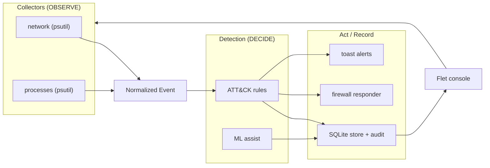

# 🛡️ Aegis — Host Firewall & Intrusion Detection System

> A defensive, blue-team **host security monitoring, detection & response** tool
> for Windows endpoints. Aegis watches live network and process activity,
> evaluates it with **explainable, MITRE ATT&CK-mapped detection rules** (plus an
> *evaluated* ML anomaly assist), keeps an **immutable audit trail**, raises
> real-time alerts, and can **contain** a suspicious host via the Windows Firewall
> — all from a clean, modern console.


---

## Why this exists

Endpoints are where most intrusions land. Defenders need three things on the
host: **visibility** (what is my machine doing?), **detection** (is any of it
suspicious, in ATT&CK terms?), and **response** (contain it fast). Aegis
demonstrates that full loop end-to-end — as a real, tested, documented product,
not a script.

> This project began as a small "netsh GUI" (a firewall rule viewer) and was
> **re-architected** into a modular detection platform. The original code had a
> command-injection vulnerability (`shell=True` + string-built commands); a core
> goal here was to fix that class of bug properly and build outward from a secure,
> tested foundation. See [`docs/THREAT_MODEL.md`](docs/THREAT_MODEL.md).

## Features

| Area | What it does |
|------|--------------|
| 🔎 **Live monitoring** | Polls network connections & processes via `psutil`, normalized into a typed event stream |
| 🧠 **Detection engine** | Explainable rules mapped to **MITRE ATT&CK**; every alert carries its technique + reasons |
| 🤖 **ML anomaly assist** | `IsolationForest` outlier detection, **evaluated** (precision/recall) — rules lead, ML assists |
| 🧱 **Secure firewall engine** | Create / delete / toggle rules and **block/contain** IPs via `netsh` — argument-list execution, **no `shell=True`**, full input validation |
| 🔔 **Real-time alerts** | Windows toast notifications with cooldown de-duplication |
| 🧾 **Append-only audit trail** | Every rule change, detection and response is recorded for accountability |
| 📊 **Analytics dashboard** | KPIs, severity breakdown, alert timeline, top talkers & top ATT&CK techniques |
| ⚙️ **Configurable** | Poll intervals, alert thresholds, anomaly toggle, optional auto-response |

## Architecture (modular, event-driven)



One normalized `Event` type decouples collectors from detection, so new telemetry
(Sysmon/ETW) or new rules can be added without touching the rest.
Full design: [`docs/ARCHITECTURE.md`](docs/ARCHITECTURE.md).

## MITRE ATT&CK coverage

| Technique | Name | Rule |
|-----------|------|------|
| **T1571** | Non-Standard Port | C2/backdoor default ports; uncommon high ports to public hosts |
| **T1021** | Remote Services | RDP / SMB / WinRM connections (lateral movement) |
| **T1071** | Application-Layer Protocol | Legacy plaintext protocols to public hosts |
| **T1059** | Command & Scripting Interpreter | PowerShell/cmd/mshta/rundll32 making network connections |
| **T1046** | Network Service Scanning | One process contacting many hosts in a short window |
| **T1036** | Masquerading | Processes from temp dirs / system-name spoofing |

Details: [`docs/DETECTIONS.md`](docs/DETECTIONS.md).

## Quick start

```bash
# 1. Create a virtual environment
python -m venv .venv
.venv\Scripts\activate

# 2. Install
pip install -r requirements.txt

# 3. Run the console
python -m aegis
```

> **Privileges:** viewing telemetry and detections needs **no admin**. *Creating,
> deleting, or blocking* firewall rules requires running as **Administrator**
> (Aegis tells you which mode you're in).

## Security posture

- **No command injection:** the firewall engine executes argument lists with
  `shell=False`; all user input is validated first. Proven by a dedicated validator + firewall injection test suite
  including live injection payloads.
- **No network egress:** Aegis is entirely local — no telemetry leaves the host.
- **Least privilege:** read-only monitoring runs unprivileged.
- **Auditable:** every privileged action is written to an append-only audit trail.

## Testing

```bash
pytest                      # 125 tests
pytest --cov=aegis          # ~84% backend coverage
ruff check aegis tests      # lint
python evaluation/evaluate_ml.py   # reproduce ML metrics
```

CI runs lint + tests on Windows for Python 3.11 & 3.12 (`.github/workflows/ci.yml`).

## Project structure

```
aegis/
  core/         events · models · validators        # shared language
  collectors/   network · processes                 # OBSERVE
  detection/    engine · rules/ (ATT&CK) · ml_assist # DECIDE
  response/     firewall (secure netsh engine)       # ACT
  storage/      SQLite EventStore + audit            # RECORD
  alerting/     toast notifier                        # NOTIFY
  ui/           Flet console (7 views)                # PRESENT
  service.py    orchestrator
docs/           THREAT_MODEL · ARCHITECTURE · DETECTIONS · ML_EVALUATION
evaluation/     reproducible ML evaluation harness
tests/          125 tests (unit · injection · contract · integration)
```

## Building a standalone executable

```bash
pip install pyinstaller
pyinstaller --noconfirm --windowed --name Aegis ^
    --add-data "assets;assets" aegis/__main__.py
```

## Roadmap / future work

- **Sysmon / ETW collectors** for kernel-grade telemetry (catches short-lived
  connections and in-memory techniques psutil can't see).
- **Locale-independent firewall** via the Windows COM API (`INetFwPolicy2`).
- **Sigma rule import** and a distributed (multi-host) mode via the `api/` package.

## Disclaimer

Aegis is a **defensive, educational** tool. It is not a kernel-level EDR and does
not replace commercial endpoint protection. See the threat model for its
explicit scope and limits.

## License

MIT.
