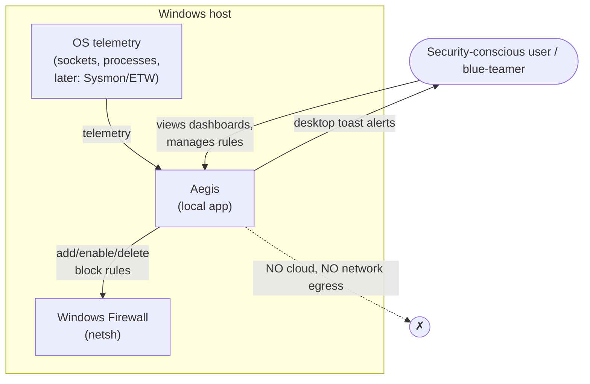
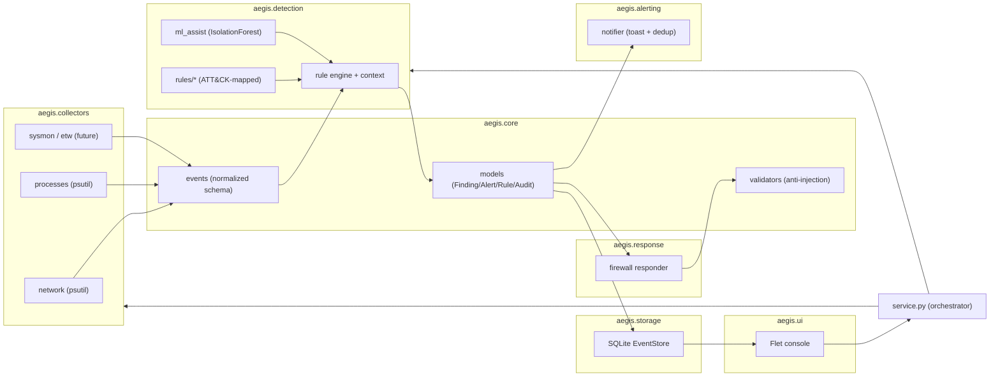
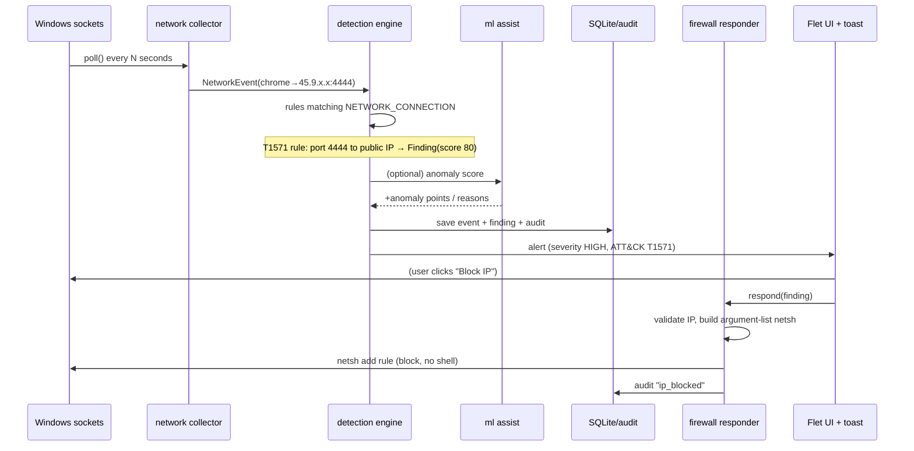

# Aegis — Architecture

Aegis is a **modular, event-driven host detection & response tool** for Windows.
This document explains the design, the responsibility of every module, how data
flows end to end, and how to extend the system.

---

## 1. Design philosophy

The whole system is organized around **one idea**: separate *observing* from
*deciding* from *acting*, and connect them with a single, source-agnostic data
type — the **normalized `Event`**.

```
        OBSERVE                DECIDE                 ACT / RECORD
   ┌───────────────┐     ┌────────────────┐     ┌───────────────────┐
   │  Collectors   │──►  │ Detection      │──►  │ Response          │
   │ (psutil,      │Event│ engine         │Find-│ Alerting          │
   │  Sysmon, ETW) │     │ (rules + ML)   │ ing │ Storage / Audit   │
   └───────────────┘     └────────────────┘     └───────────────────┘
```

Because collectors depend only on the `Event` contract — not the other way around
— we can add a new telemetry source (e.g. Sysmon) **without touching detection**,
and add a new detection **without touching collectors**. This is the property that
makes the codebase testable, extensible, and interview-defensible.

**Principles applied:**
- **Separation of concerns / layering** — data plane (events) vs decision plane
  (findings) vs action plane (response) vs presentation (UI).
- **Dependency inversion (SOLID-D)** — high-level pipeline depends on *abstract*
  `Collector` / `DetectionRule` / `Responder` / `EventStore`, never concretions.
- **Open/closed (SOLID-O)** — new rules/collectors/responders are added, existing
  code isn't modified.
- **Fail-safe** — a monitor error degrades gracefully; it never crashes the tool.
- **Explainability** — every `Finding` carries its rule, ATT&CK mapping, and reasons.

## 2. System context (C4 level 1)



Aegis is entirely local. There is **no server and no network egress** — a
deliberate privacy and security decision (see `THREAT_MODEL.md`).

## 3. Container / module view (C4 level 2)



## 4. The modules (responsibilities)

| Package / module | Responsibility |
|------------------|----------------|
| `core/events.py` | **Normalized telemetry schema** — `Event`, `NetworkEvent`, `ProcessEvent`, `EventType/Source/Direction`. Immutable (frozen) value objects. |
| `core/models.py` | **Decision/domain models** — `Severity`, `Finding`, `Alert`, `AuditEvent`, `FirewallRule` + firewall enums. |
| `core/validators.py` | **Input validation** for rule fields (names, IPs, ports, paths). The anti-command-injection front line. |
| `collectors/base.py` | `Collector` ABC — the contract every telemetry source implements (`poll`, lifecycle, `available()`). |
| `collectors/network.py`, `processes.py` | psutil-based collectors emitting `NetworkEvent`/`ProcessEvent`. |
| `detection/base.py` | `DetectionRule` ABC + thread-safe `DetectionContext` (rolling history for stateful rules). |
| `detection/ports.py` | Shared port constants (single source of truth for rules + ML). |
| `detection/engine.py` | `DetectionEngine` — offers each event to matching rules, collects findings. |
| `detection/rules/*` | Concrete **ATT&CK-mapped** rules (C2 port, remote-svc, interpreter, scanning, masquerade…). |
| `detection/ml_assist.py` | IsolationForest anomaly **assist**, with a reproducible evaluation harness. |
| `response/base.py` | `Responder` ABC + `ResponseResult`. |
| `response/firewall.py` | Secure `netsh` engine (argument-list, validated) + block/contain actions. |
| `storage/base.py` | `EventStore` ABC — persistence contract. |
| `storage/database.py` | SQLite implementation (WAL, thread-safe) for events/findings/alerts/audit. |
| `alerting/notifier.py` | Desktop toast notifications with cooldown de-duplication. |
| `service.py` | **Orchestrator** — wires collectors → engine → store/alert/response; the single API the UI talks to. |
| `ui/` | Flet security console (dashboard, connections, processes, detections, rules, audit, settings). |
| `api/` | Reserved thin FastAPI surface for a future distributed deployment (not yet implemented). |
| `config.py` / `logging_config.py` | Settings (persisted JSON) and rotating structured logging. |

All modules above are implemented. The backend (core, collectors, detection, ML,
response, storage, alerting, service) is covered by the test suite (~84% line
coverage); the `ui/` package is validated by a headless construction test and live
runs rather than pytest (the usual pragmatic split for GUI code). `api/` is an
intentional, documented placeholder for the distributed roadmap.

## 5. Key abstractions (the contracts)

```python
# A telemetry source
class Collector(ABC):
    source: EventSource
    def poll(self) -> Iterable[Event]: ...      # one scan
    def available(self) -> bool: ...            # can it run here?

# A detection
class DetectionRule(ABC):
    rule_id: str; technique: str; tactic: str; severity: Severity
    event_types: tuple[EventType, ...]          # engine pre-filters on this
    def evaluate(self, event: Event, ctx: DetectionContext) -> Finding | None: ...

# A response action
class Responder(ABC):
    def can_handle(self, finding: Finding) -> bool: ...
    def respond(self, finding: Finding) -> ResponseResult: ...

# Persistence
class EventStore(ABC):
    def save_events(...); save_finding(...); save_alert(...); add_audit(...)
```

Adding a capability means implementing one small interface — nothing else changes.

## 6. Data flow — a suspicious connection, end to end



The same path works whether the event came from psutil today or Sysmon/ETW later
— the engine only ever sees a normalized `Event`.

## 7. Concurrency model

- **Collectors** run on **background daemon threads**, polling on a configurable
  interval. Each poll is wrapped so an exception logs and the loop continues.
- The **detection engine** processes events off those threads and writes to SQLite.
- **SQLite** runs in WAL mode with a process-wide lock, safe for the handful of
  monitor threads plus the UI thread.
- The **UI** (Flet) runs its own event loop; background→UI updates are marshalled
  onto the UI thread (no cross-thread widget mutation).
- On shutdown, monitors are signalled to stop and the ML model is persisted.

## 8. Extension points (open/closed in practice)

| To add… | Do this | Nothing else changes because… |
|---------|---------|-------------------------------|
| A telemetry source | Subclass `Collector`, emit `Event`s | the engine depends on `Event`, not the source |
| A detection | Subclass `DetectionRule`, set ATT&CK metadata | the engine iterates rules generically |
| A response | Subclass `Responder` | the orchestrator dispatches by `can_handle()` |
| A storage backend | Implement `EventStore` | callers depend on the interface |

## 9. Directory layout

```
aegis/
├── core/         events.py · models.py · validators.py     # the shared language
├── collectors/   base.py (+ network.py, processes.py …)    # OBSERVE
├── detection/    base.py + rules/ + ml_assist.py           # DECIDE
├── response/     base.py (+ firewall.py)                   # ACT
├── storage/      base.py (+ database.py)                   # RECORD
├── alerting/     notifier.py                               # NOTIFY
├── api/          (optional FastAPI, future)                # DECOUPLE
├── ui/           Flet console                              # PRESENT
├── service.py    orchestrator                              # WIRE
├── config.py · logging_config.py                           # cross-cutting
docs/             THREAT_MODEL.md · ARCHITECTURE.md
tests/            unit + injection + contract tests
reference_scaffold/   archived legacy (excluded from tooling)
```

## 10. Technology choices (rationale in brief)

| Choice | Why | Alternative rejected |
|--------|-----|----------------------|
| **Python 3.11+** | Rapid, readable, great security ecosystem | — |
| **Flet 0.86** | Modern Python UI + charts; keeps one language | Electron/Tauri (extra toolchain) |
| **psutil** | Portable socket/process telemetry, no driver | raw ETW-only (harder, later) |
| **SQLite (WAL)** | Zero-config local store, transactional | Postgres/OpenSearch (overkill for one host) |
| **scikit-learn IsolationForest** | Simple, explainable-enough anomaly *assist* | Deep models (unjustified complexity) |
| **MITRE ATT&CK mapping** | The language of detection engineering | ad-hoc severity only |
| **pytest + ruff + GitHub Actions** | Tested, linted, CI-verified | untested scripts |

## 11. Scalability path (documented, not built here)

Single-host today; the seams to grow are already in place:

```
Today:   [ collectors → engine → SQLite → Flet ]   (one process, one host)

Future:  [ agent: collectors → engine ] --HTTP--> [ FastAPI + OpenSearch ]
                                                          │
                                                    [ web console ]   (many hosts)
```

Swapping `EventStore` (SQLite → OpenSearch) and exposing the engine behind the
existing `api/` package turns Aegis into a multi-host, EDR-style system **without
rewriting** collectors or detections. That is the payoff of the Option B design.
