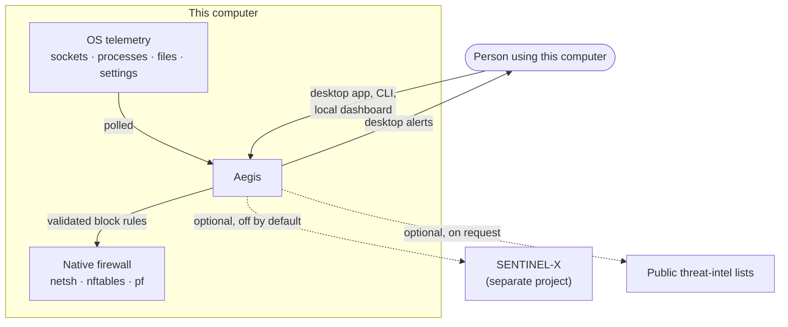
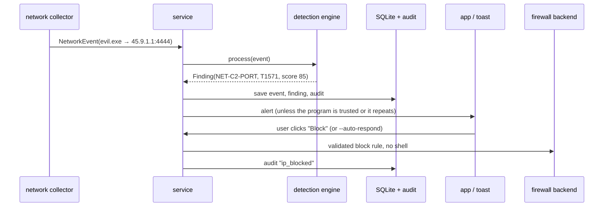

# Aegis — Architecture

Aegis is **endpoint security and hardening for one computer**. It answers one
question: *is this machine secure, what weaknesses exist, and how can they be
detected and safely fixed?* It runs on Windows, Linux and macOS.

Aegis is deliberately **not** a SIEM, a central log platform or a multi-host
investigation tool. Investigation across machines belongs to the separate
SENTINEL-X project. Aegis can optionally *export* its events to SENTINEL-X, but
that is an add-on integration: Aegis works completely without it.

---

## 1. Design idea

Observing, deciding and acting are kept apart and connected by one
source-agnostic data type, the normalized **`Event`**:

```
      OBSERVE                 DECIDE                  ACT / RECORD
 ┌────────────────┐     ┌─────────────────┐     ┌──────────────────────┐
 │ Collectors     │──►  │ Detection engine│──►  │ Alerts · Response    │
 │ network,       │Event│ Python rules,   │Find-│ SQLite store · Audit │
 │ processes,     │     │ Sigma, threat   │ ing │ (optional export)    │
 │ file integrity │     │ intel, ML assist│     │                      │
 └────────────────┘     └─────────────────┘     └──────────────────────┘

 Security check (posture):  checks ──► PostureReport ──► score, weaknesses, advice
```

Collectors depend only on the `Event` contract, so a new telemetry source needs
no detection changes and a new detection needs no collector changes.

**Principles**
- **Layering.** The engine (core, collectors, detection, posture, response,
  storage, alerting, intel) never imports a front end (UI, dashboard, CLI) or
  the export package. `tests/test_architecture.py` enforces this.
- **Dependency inversion.** The pipeline depends on `Collector`,
  `DetectionRule`, `PostureCheck`, `FirewallBackend` and `EventStore`, never on
  concrete classes.
- **Fail safe.** A failing collector, rule or check is logged and skipped. A
  monitoring tool must never crash the host it protects.
- **Explainable.** Every finding carries its rule, MITRE ATT&CK mapping,
  reasons and plain-language guidance.
- **Every action is recorded.** Rule changes, blocks and detections are written
  to the audit trail.

## 2. System context



By default Aegis makes no network calls. The only outbound traffic is a
threat-intel list download the user asks for (`aegis intel update`) and export
to SENTINEL-X when the user enables it.

## 3. Modules

| Package / module | Responsibility |
|---|---|
| `core/events.py` | Normalized, immutable telemetry: `NetworkEvent`, `ProcessEvent`, `FileEvent`. |
| `core/models.py` | Domain models: `Severity`, `Finding`, `Alert`, `AuditEvent`, `FirewallRule`. |
| `core/validators.py` | Input validation for rule fields; the front line against command injection. |
| `collectors/` | psutil network and process collectors, and file integrity monitoring (baseline + digest comparison). |
| `detection/engine.py`, `base.py` | Offers each event to the rules that want it; shared rolling `DetectionContext`. |
| `detection/rules/` | Hand-written, stateful, ATT&CK-mapped rules (network, process, file, threat intel). |
| `detection/sigma/` | Loader, condition parser and field mapping for Sigma rules; bundled rules in `sigma/rules/`. |
| `detection/ruleset.py` | Combines built-in and Sigma rules into the active rule set. |
| `detection/ml_assist.py` | IsolationForest anomaly assist (evaluated in `docs/ML_EVALUATION.md`). |
| `detection/trust.py`, `guidance.py` | Programs the user trusts; plain-language "what to do" advice per technique. |
| `posture/` | The security check: firewall, exposed services, updates, startup programs, Defender, UAC, RDP, SMBv1, auto-logon, disk encryption, SSH, sensitive file permissions. Produces a scored `PostureReport`. |
| `intel/` | Local threat-intel blocklists (IPs and CIDR ranges) and the feed downloader. |
| `response/` | `FirewallBackend` contract with Windows (`netsh`), Linux (`nftables`) and macOS (`pf` anchor) engines; argument-list execution, never a shell. `NullFirewall` when no backend is usable. |
| `storage/` | `EventStore` contract and its SQLite (WAL) implementation for events, findings, alerts and audit. |
| `alerting/notifier.py` | Desktop notifications with cooldown de-duplication. |
| `service.py` | Orchestrator: collectors → engine → store / alert / response, the single façade the front ends use. |
| `ui/` | Flet desktop app: dashboard, security check, connections, processes, detections, rules, audit, settings. |
| `api/` | Local web dashboard (`aegis serve`): loopback only, token, Host allow-list, strict CSP. A view of this one computer. |
| `reporting.py` | Self-contained, escaped HTML security report (`aegis report`). |
| `cli.py` | `status`, `monitor`, `check`, `sigma`, `intel`, `serve`, `report`, `rules`, `block`, `console`. |
| `forwarding/` | **Optional** export to SENTINEL-X: shared-schema mapping, SQLite outbox, HTTPS sender with backoff, heartbeat. Off by default. |
| `config.py`, `platforms.py`, `logging_config.py` | Settings (JSON), OS and privilege detection, rotating logs. |

## 4. Key contracts

```python
class Collector(ABC):
    def poll(self) -> Iterable[Event]: ...
    def available(self) -> bool: ...

class DetectionRule(ABC):
    rule_id: str; technique: str; tactic: str; severity: Severity
    event_types: tuple[EventType, ...]
    def evaluate(self, event: Event, ctx: DetectionContext) -> Finding | None: ...

class PostureCheck(ABC):
    check_id: str
    def run(self, ctx: PostureContext) -> CheckResult: ...

class FirewallBackend(ABC):
    def create_rule(self, rule: FirewallRule) -> FirewallResult: ...
    def block_ip(self, ip: str, ...) -> FirewallResult: ...

class EventStore(ABC):
    def save_events(...); save_finding(...); save_alert(...); add_audit(...)
```

Adding a capability means implementing one of these interfaces.

## 5. Data flow: a suspicious connection



## 6. Concurrency and lifecycle

- Each collector polls on its own daemon thread; every poll is guarded.
- SQLite runs in WAL mode behind a re-entrant lock shared by the monitor
  threads and the UI.
- UI updates are marshalled onto the Flet event loop.
- On start the service purges data past retention and, on Linux with root,
  re-applies saved nftables rules (nftables does not persist across reboots).
- On stop, collectors are signalled, the optional exporter flushes, and the ML
  model is saved.

## 7. Extension points

| To add… | Implement | Why nothing else changes |
|---|---|---|
| Telemetry source | `Collector` | the engine only sees `Event` |
| Detection | `DetectionRule`, or drop a Sigma YAML file | the engine iterates rules generically |
| Security check | `PostureCheck` | the report scores any check result |
| Firewall platform | `FirewallBackend` | the factory picks the backend per OS |
| Storage | `EventStore` | callers use the interface |

## 8. Layout

```
aegis/
├── core/        shared language: events, models, validators
├── collectors/  OBSERVE   network · processes · file integrity
├── detection/   DECIDE    rules · sigma · ml_assist · trust · guidance
├── posture/     AUDIT     security check and score
├── intel/       threat-intel blocklists
├── response/    ACT       netsh · nftables · pf backends
├── storage/     RECORD    SQLite store and audit trail
├── alerting/    NOTIFY    desktop notifications
├── service.py   WIRE      orchestrator
├── ui/ api/ cli.py reporting.py   front ends
└── forwarding/  optional export to SENTINEL-X
docs/        ARCHITECTURE · DETECTIONS · THREAT_MODEL · ML_EVALUATION
evaluation/  reproducible ML evaluation
packaging/   Windows build (PyInstaller + Inno Setup)
shared/      event_schema.json (export contract)
tests/       unit, contract, injection and architecture tests
```

## 9. Technology choices

| Choice | Why |
|---|---|
| Python 3.11+ | readable, strong security ecosystem |
| Flet | desktop UI in the same language |
| psutil | portable socket and process telemetry, no driver |
| SQLite (WAL) | zero-configuration local store; right-sized for one host |
| Sigma + MITRE ATT&CK | the industry's detection format and vocabulary |
| scikit-learn IsolationForest | a simple, explainable anomaly *assist* |
| pytest, ruff, GitHub Actions | tested on Linux, Windows and macOS on every push |

## 10. Scope

**In scope:** security audit, hardening guidance, monitoring, local detection,
responses on this computer, and a local dashboard of this computer.

**Out of scope:** central log management, multi-host correlation, incident
management, attack-chain reconstruction and SOC analytics. Those belong to
SENTINEL-X, which Aegis can feed through its optional export.
