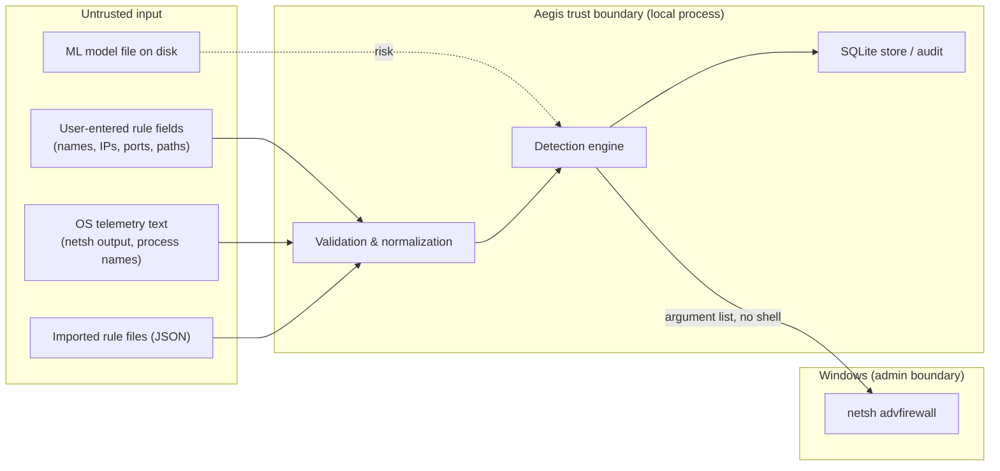

# Aegis — Threat Model

> A security tool is itself a high-value target. This document models threats in
> **two directions**:
>
> 1. **Defensive scope** — the host threats Aegis is designed to help *detect and
>    respond to* (mapped to MITRE ATT&CK).
> 2. **Self-protection** — threats *against Aegis itself*, and the controls that
>    keep the tool from becoming an attack surface.
>
> It also states, honestly, what Aegis does **not** cover — because knowing the
> limits of a control is part of using it responsibly.

---

## 1. System overview

Aegis is a **host-based security monitoring, detection & response tool for Windows
endpoints**. It runs locally, with no cloud component. It:

- observes local **network connections** and **processes**,
- evaluates them with **explainable, ATT&CK-mapped detection rules** (plus a
  clearly-scoped ML anomaly *assist*),
- records an **append-only audit trail** and raises **alerts**,
- can **respond** by adding Windows Firewall block rules to contain a host.

## 2. Assets to protect

| # | Asset | Why it matters |
|---|-------|----------------|
| A1 | **Integrity of firewall rules** | Aegis can add/modify/delete Windows Firewall rules. Tampering could open or wrongly close the host. |
| A2 | **Audit log & event store** (`aegis.db`) | The record of what happened and what Aegis did. Append-only via the app; note it is a local SQLite file, so cryptographic tamper-resistance (hash-chained audit) is **future work**, not a current guarantee. |
| A3 | **Detection logic & config** | If an attacker can disable rules or raise thresholds, detection blinds itself. |
| A4 | **The ML model file** (`anomaly_model.joblib`) | A deserialized model is code-adjacent; a poisoned/malicious model file is a risk. |
| A5 | **Aegis' own privileges** | Rule changes require Administrator. Aegis is a privileged surface. |
| A6 | **User confidentiality** | Telemetry (connections, process names) is sensitive; it must never leave the host. |

## 3. Trust boundaries

Every arrow crossing **into** the Aegis boundary is treated as **untrusted** and
must be validated. The boundary to Windows (`netsh`) is crossed only via an
argument list — never a shell string.

## 4. Adversaries

| Actor | Capability | Goal |
|-------|-----------|------|
| **Remote malware / C2** | Code running as the user; makes outbound connections | Beacon out, exfiltrate, pull tooling |
| **Local unprivileged malware** | Runs as the user, no admin | Evade detection, persist, escalate |
| **Malicious rule input** | Supplies crafted rule names/fields (or a poisoned import/model file) | Inject commands, corrupt state |
| **Curious/insider user** | Local interactive access | Read data they shouldn't, disable protection |

Out of scope actors: a **kernel-level / SYSTEM attacker** (they already outrank a
user-mode tool), and a **physical attacker** with disk access.

## 5. Defensive scope — what Aegis detects (MITRE ATT&CK)

Detections are built as explainable rules. Coverage is **honest about the
telemetry required**: psutil sees socket/process *state*; deeper techniques need
Sysmon/ETW (later phases).

| ATT&CK ID | Technique | How Aegis detects it | Telemetry | Phase |
|-----------|-----------|----------------------|-----------|-------|
| **T1071** | Application-Layer Protocol (C2) | Outbound to uncommon ports / rare remote hosts | psutil | P5 |
| **T1571** | Non-Standard Port | Known service on an unexpected port, or high port to public IP | psutil | P5 |
| **T1046** | Network Service Scanning | One process → many distinct hosts/ports in a short window | psutil + context | P5 |
| **T1021** | Remote Services (RDP/SMB/WinRM lateral movement) | Connections on 3389/445/5985 to/from internal hosts | psutil | P5 |
| **T1048** | Exfiltration over alternative protocol | Large/steady outbound on unusual ports | psutil (heuristic) | P5/P6 |
| **T1105** | Ingress Tool Transfer | Inbound/download patterns to suspicious processes | psutil | P5 |
| **T1059** | Command/Scripting Interpreter | `powershell`/`cmd`/`wscript` making network connections | psutil + process | P5 |
| **T1055** | Process Injection | *Requires Sysmon/ETW* — **not detectable via psutil** | Sysmon/ETW | Future |
| **T1547** | Boot/Logon Autostart (persistence) | *Requires registry/autorun telemetry* | Sysmon/osquery | Future |

The ML **anomaly assist** (IsolationForest) supplements — never replaces — these
rules, flagging statistical outliers that no single rule anticipated. It is
**evaluated with precision/recall on a labeled scenario** (Phase 6) so its value
is measured, not assumed.

## 6. Self-protection — STRIDE analysis of Aegis itself

| Threat (STRIDE) | Scenario | Control in Aegis |
|-----------------|----------|------------------|
| **Spoofing** | Malicious input claims to be a valid rule | All rule fields validated (`core/validators.py`) before use |
| **Tampering** | Injected `netsh` command via a crafted rule name | **No `shell=True`; argument-list execution**; forbidden-character rejection. Regression-tested (validator + firewall injection suites) |
| **Tampering** | Poisoned ML model file executes on load | Model treated as untrusted; load is guarded and failure-safe; documented residual risk (§8) |
| **Repudiation** | "I didn't change that rule" | Every rule change / response is written to the **audit log** with timestamp + actor |
| **Information disclosure** | Telemetry leaks off-host | **No network egress by design**; data stays in local SQLite; secrets never logged |
| **Denial of service** | Monitor thread crashes the app | Collectors/monitors wrap work in guarded loops; a failure logs and continues, never kills the app |
| **Elevation of privilege** | Tool tricked into misusing admin rights | Least privilege: **read-only views need no admin**; only rule *changes* require it, and Aegis detects/report its own privilege level |

## 7. Key security controls (summary)

1. **Input validation everywhere** — anti-injection, anti-corruption. First line of defence.
2. **No shell execution** — subprocess called with argument lists (`shell=False`).
3. **Least privilege** — monitoring/reading works unprivileged; elevation only for rule mutation.
4. **No external communication** — zero telemetry/network egress; verified by audit.
5. **Append-only audit trail** — accountability for every privileged action.
6. **Fail-safe monitoring** — a subsystem error degrades gracefully, never crashes the host tool.
7. **Explainable detections** — every alert carries its rule, ATT&CK mapping, and reasons (no black boxes).
8. **Defensive dependencies** — small, well-known libraries; runtime data git-ignored so it can't leak into the repo.

## 8. Out of scope & residual risks (honest limits)

- **Not a kernel-level EDR.** psutil polling can **miss short-lived connections**
  (sub-poll-interval beacons) and cannot see in-memory techniques (injection,
  hollowing). Mitigation path: Sysmon/ETW collectors (documented, later phase).
- **A SYSTEM/kernel attacker** can disable or blind any user-mode tool, including
  Aegis. We do not claim protection against an adversary who already outranks us.
- **ML model file (`*.joblib`) uses pickle-based serialization**, which is unsafe
  if replaced by an attacker with write access to the app-data dir. Residual risk;
  mitigated by (a) the file living in a per-user dir, (b) guarded loading, and
  (c) a documented option to disable the ML assist entirely.
- **No multi-host / central management** in this scope (single-endpoint tool). The
  architecture leaves a clean path to a distributed model (see `ARCHITECTURE.md`).
- **Not a replacement** for Windows Defender / a commercial EDR; Aegis is a
  focused, educational, defensible *complement*.

## 9. Assumptions

- The host OS and the Python runtime are not already fully compromised at install.
- The user running Aegis is authorized to manage the host's firewall.
- Administrator elevation is granted deliberately by the user for rule changes.
